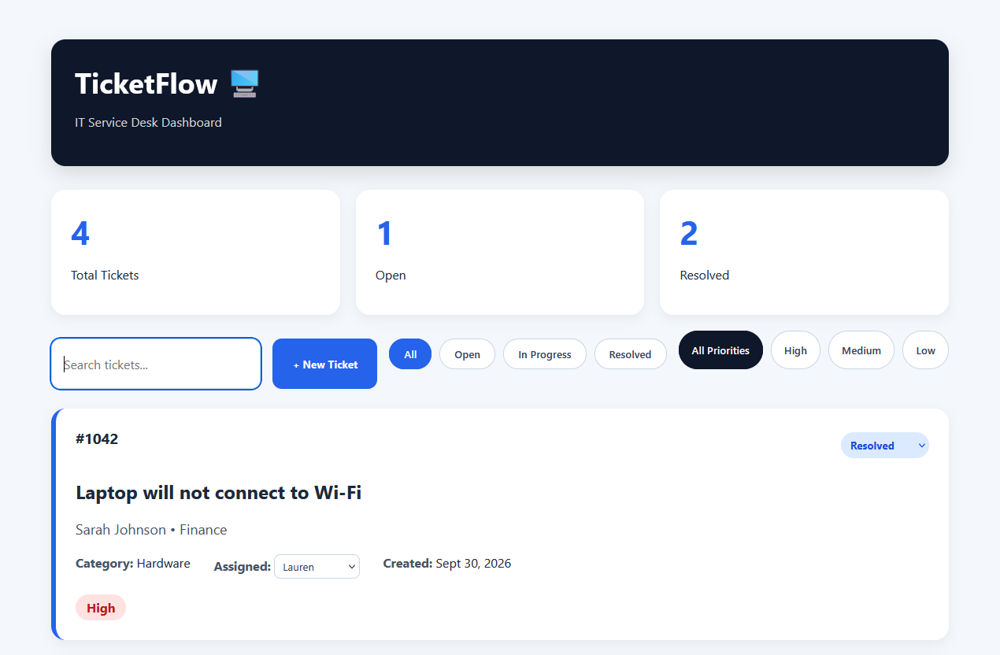

# TicketFlow

TicketFlow is a responsive IT service desk dashboard built with HTML, CSS, and JavaScript.

It allows users to create and manage support tickets, search and filter the queue, update ticket status, assign technicians, track priority levels, and retain ticket data using browser localStorage.

## Features

- Create new support tickets
- Automatic ticket ID generation
- Search tickets
- Filter by status
- Filter by priority
- Update ticket status
- Assign technicians
- Persistent browser storage with localStorage
- Dynamic dashboard statistics
- Responsive service desk interface

## Live Demo

https://pretty-pink-poodle.github.io/ticketflow/

## Preview

